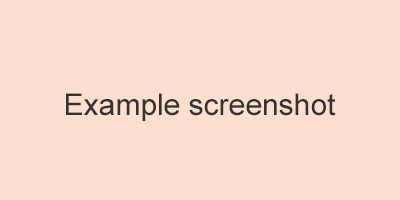

# test-logic

> Form Validation

[](https://travis-ci.org/onface/test-logic)
[](https://npmjs.org/package/test-logic)
[](https://npmjs.org/package/test-logic)

[](https://saucelabs.com/u/test-logic)

`test-logic` 表单校验逻辑层封装

```js
var TestLogic = require('test-logic')
```

## Feature

1. `async` 异步
2. `every` 惰性
3. `queue` 队列
4. `prior` 优先

`test-logic` 提供各种场景表单校验的逻辑封装。因为是纯逻辑封装，在客户端和服务端都可使用 `test-logic`。

### async

校验必填 => 校验邮箱格式 => 校验邮箱是否已存在

<!-- {
    markrun_lastrun: true
} -->
````js
var test = new TestLogic()
test.checkAll(
    [
        {
            label: '邮箱',
            value: 'mail@qq.com',
            test: [
                'required',
                'email',
                function hasEmail (pass, fail, value) {
                    setTimeout(function mockAJAX() {
                        if (/abc@qq\.com$/.test(value)) {
                            fail('{{label}}已注册过')
                        }
                        else {
                            pass()
                        }
                    }, 400)
                }
            ]
        }
    ],
    {
        finish: function (fail, errors, data) {
            if (fail) {
                console.error('async', errors[0].msg)
            }
            else {
                console.info('async', 'pass')
            }
        }
    }
)
````

## every

````js
var test = new TestLogic()
test.checkAll(
    [
        {
            label: '邮箱',
            value: 'admin',
            test: [
                'email',
                {
                    regexp: /admin/,
                    be: false,
                    msg: '{{label}}不允许存在 admin'
                }
            ],
            // 规则 every 校验遇到错误则不进行后续校验（默认为 false)
            every: true
        },
        {
            label: '密码',
            value: 'abcdefg',
            test: [
                function (pass, fail, value) {
                    console.log('进入密码校验')
                    if (value !== '123456') {
                        fail('密码错误')
                    }
                    else {
                        pass()
                    }
                }
            ]
        }
    ],
    {
        // 表单项 ever 校验遇到错误则不进行后续校验 (默认为 true)
        every: false,
        finish: function (fail, errors, data) {
            if (fail) {
                console.error('every', errors[0].msg)
                console.error(errors)
                console.log(data)
            }
        }
    }
)
````

## Install

```shell
npm install test-logic --save
```

## Example

[](http://onface.github.io/test-logic/example)

## Online documentation

[Online](http://onface.github.io/test-logic)

## Change log

[CHANGELOG](./CHANGELOG.md)


## Maintainers

<table>
  <tbody>
    <tr>
    <td align="center">
        <a href="https://github.com/grifree"></a>
        <br>
        <a href="https://github.com/grifree">Grifree</a>
    </td>
      <td align="center">
        <a href="https://github.com/nimojs"></a>
        <br>
        <a href="https://github.com/nimojs">NimoChu</a>
      </td>
    <tr>
  <tbody>
</table>
